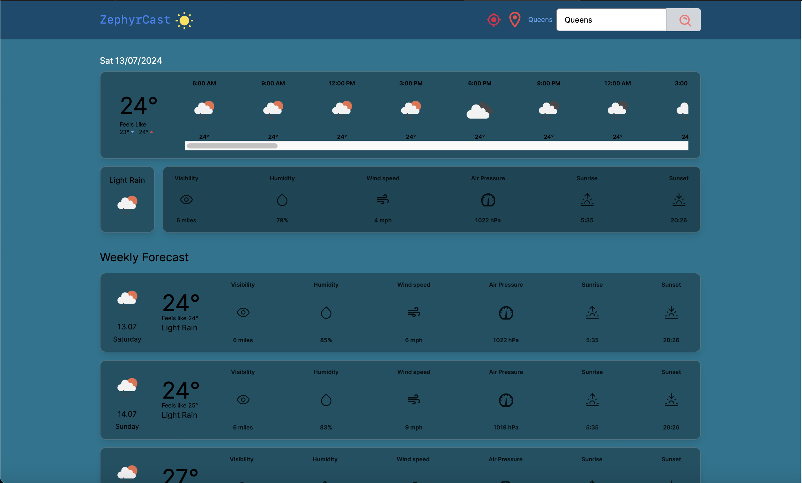

# ZephyrCast



ZephyrCast is a visually appealing weather forecasting application that provides users with real-time weather updates, detailed forecasts, and an elegant dark theme inspired by iOS/macOS aesthetics. The app utilizes the OpenWeatherMap API to fetch weather data and presents it with beautiful 3D glass effects and modern color schemes.

## Features

- Real-time weather updates for any location.
- Detailed daily and weekly forecasts.
- Elegant dark theme with 3D glass effects.
- Responsive design for a seamless experience across devices.

## Tech Stack

- **React**: A JavaScript library for building user interfaces.
- **Next.js**: A React framework for server-side rendering and generating static websites.
- **TypeScript**: A typed superset of JavaScript that compiles to plain JavaScript.
- **Axios**: A promise-based HTTP client for the browser and Node.js.
- **Tailwind CSS**: A utility-first CSS framework for rapid UI development.
- **React Query**: A library for fetching, caching, and updating asynchronous data in React.
- **date-fns**: A modern JavaScript date utility library.

## Installation

1. **Clone the repository**:
   ```sh
   git clone https://github.com/ntehseen/zephyrcast.git
   cd zephyrcast
   ```

2. **Install dependencies**:
   ```sh
   npm install
   ```

3. **Set up environment variables**:
   Create a `.env.local` file in the root directory and add your OpenWeatherMap API key:
   ```plaintext
   NEXT_PUBLIC_WEATHER_KEY='your_openweathermap_api_key'
   ```

4. **Run the development server**:
   ```sh
   npm run dev
   ```

   Open [http://localhost:3000](http://localhost:3000) to view it in the browser.

## Project Structure

```
├── components
│   ├── Container.tsx
│   ├── ForecastWeatherDetail.tsx
│   ├── Navbar.tsx
│   ├── WeatherDetails.tsx
│   ├── WeatherIcon.tsx
├── pages
│   ├── api
│   ├── index.tsx
├── public
│   ├── favicon.ico
│   ├── vercel.svg
├── styles
│   ├── CustomStyles.module.css
├── utils
│   ├── convertKelvinToCelsius.ts
│   ├── convertWindSpeed.ts
│   ├── getDayOrNightIcon.ts
│   ├── metersToMiles.ts
├── .env.local
├── next.config.js
├── package.json
├── README.md
├── tsconfig.json
```

## Custom Styles

In the `styles` directory, you can find the `CustomStyles.module.css` file, which contains custom CSS for hiding the scrollbar:

```css
/* CustomStyles.module.css */
.noScrollbar {
  -ms-overflow-style: none; /* IE and Edge */
  scrollbar-width: none; /* Firefox */
}

.noScrollbar::-webkit-scrollbar {
  display: none; /* Chrome, Safari, and Opera */
}
```

## Usage

To use the custom scrollbar styles, import the CSS module and apply the class to the desired element in your component:

```jsx
import styles from '@/styles/CustomStyles.module.css';

<div className={`flex gap-10 sm:gap-16 overflow-x-auto w-full justify-between pr-3 ${styles.noScrollbar}`}>
  <!-- Your content here -->
</div>
```

## Contributing

Contributions are welcome! Please feel free to submit a Pull Request.

## License

This project is licensed under the MIT License.

## Acknowledgements

- [OpenWeatherMap](https://openweathermap.org/) for providing the weather data API.
- [Tailwind CSS](https://tailwindcss.com/) for the utility-first CSS framework.
- [Next.js](https://nextjs.org/) for the powerful React framework.
- [React Query](https://react-query.tanstack.com/) for data-fetching and caching.
- [date-fns](https://date-fns.org/) for modern JavaScript date utilities.

